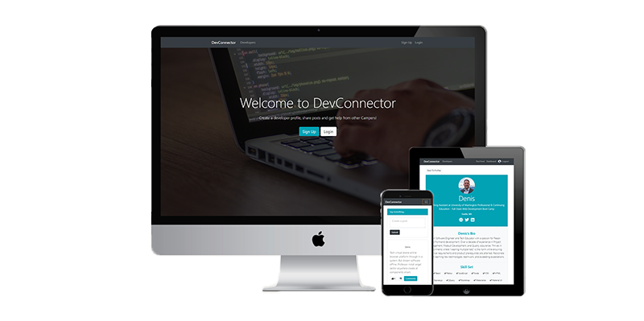

# DevConnector

Technologies used: React, Redux, Node, Express, OAuth(JSON Web Tokens), and Mongo (mLab)

## About

DevConnector is a social platform for Software Engineers to showcase their skills. Users can create profiles that will display development skills, educational and work experience, display recent GitHub repositories, create/like/unlike posts, and add comments to posts. The app also has extensive validation and error reporting.



## Cloning the repo

**Note**: Once you have the repo cloned locally, you need to create a **keys_dev.js** file in the `config` folder in the repo's root in order for the app to work. The contents of **keys_dev.js** must be:

     module.exports = {
         mongoURI: "MongoDB_URI_link_from_mLab",
         secretOrKey: "JWT_secret_string"
     };

**Note**: You will also need to register a [GitHub OAuth app](https://github.com/settings/applications/new) in order to get a **clientId** and a **clientSecret**. These need to be added to the state in client > src > components > profile > ProfileGithub.js

```
> git clone https://github.com/D-Molloy/Project_Icculus.git
> cd Project_Icculus
> npm install
> npm run client-install
> npm run dev
```

If the React development server doesn't start up, go to **localhost:3000/** in your browser.
